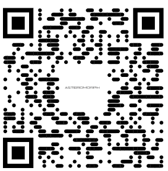

# 🦀 Rustbell: Deviceless Doorbell (Rust Edition)
## A doorbell for the broke and the bold – just scan the QR, we’re living in 2025
> A smart doorbell for hackers, minimalists, and the doorbell-averse. Just scan and notify — no wires, no worries.



---

## ✨ What’s New in the Rust Edition?

Forget servers. Forget devices. Forget Flask.

This version of **[Deviceless Doorbell](https://github.com/zzuno/Deviceless-Doorbell/)** is rewritten from scratch in Rust using [`axum`](https://github.com/tokio-rs/axum), built for performance, security, and deploy-anywhere freedom.

### 🧠 Concept:
> “If everyone has a smartphone, why do we need doorbells?”

---

## 🔔 How It Works

1. Print the QR code and stick it on your door.
2. Visitor scans it → lands on `https://your-app.fly.dev/notify`
3. A lightning-fast Rust backend sends:
   - 💬 Matrix message (via Element bot)
   - 💬 Telegram message (via Bot API)
4. You get: `🚪 Someone is at the door!`

Zero devices. Zero friction.

---

## 📦 Tech Stack

| Part      | Tool           |
|-----------|----------------|
| Backend   | [Rust](https://www.rust-lang.org/), [axum](https://github.com/tokio-rs/axum) |
| Deploy    | [Fly.io](https://fly.io/) |
| Messaging | Matrix Bot, Telegram Bot |
| Trigger   | QR code → HTTP GET |

---

## ⚙️ Environment Setup

```bash
# Required .env (or flyctl secrets set ...)
BOT_TOKEN=your_telegram_bot_token
CHAT_ID=your_telegram_chat_id
MATRIX_TOKEN=your_matrix_access_token
MATRIX_ROOM_ID=!abc123:matrix.org
```

## 🚀 Deployment (with Fly.io)

```bash
# First-time setup
flyctl launch --name rustbell

# Set secrets
flyctl secrets set \
  BOT_TOKEN=... \
  CHAT_ID=... \
  MATRIX_TOKEN=... \
  MATRIX_ROOM_ID=...

# Deploy
flyctl deploy

# Access at https://rustbell.fly.dev/notify
```

Want to self-host? Just run `cargo run` — it’s that simple.

## 📫 Notifications
Choose one or both:

🟢 Matrix → via Element bot

🔵 Telegram → via Bot API

Messages are sent instantly using `reqwest`.

## 📸 QR Code
Use the included QR code:

```bash
/assets/img1.png
```
You can customize this with your Fly URL or your own self-hosted domain.

## 🔒 Privacy
No auth. No cookies. No tracking.
Just one-way notification with zero data collection.

## 🤝 Contributing
Pull requests, feature ideas, or new integrations (Twilio? Discord?) are welcome.

This project is tiny by design. Let’s keep it that way — but fast, private, and useful.

## 💡 Inspiration
Built out of annoyance with doorbells, and the belief that the web should replace plastic buttons.

Made with 🦀 by @zzuno
